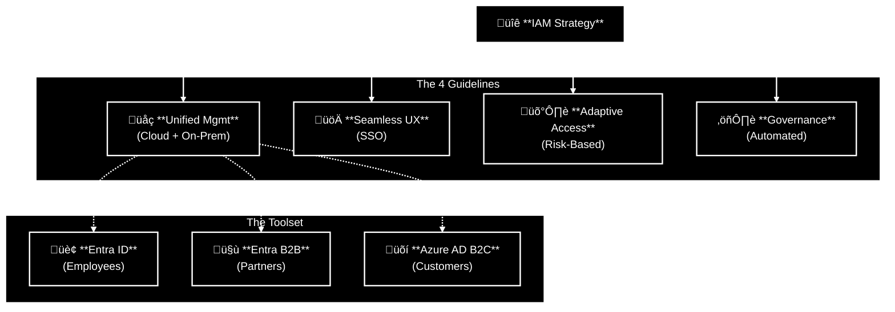
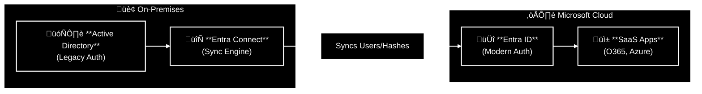

# Design Authentication and authorization solutions

Identity is the **new firewall**. In the old days, you could just hide everything behind a network perimeter and feel safe. In the cloud, that perimeter is gone. Your users are connecting from coffee shops, the API is public, and your data is everywhere.

Designing for identity means accepting a harsh reality: **Hackers don't break in anymore; they log in.**

If you treat Identity like a simple phonebook instead of a security layer, you are finished. You need to verify *who* someone is (Authentication) and strictly control *what* they can touch (Authorization). Without this, your fancy encryption and network rules are just expensive decorations on a house with the front door left wide open.

**Bottom line:**
Secure the identity first. If you don't, you aren't an Architect; you're just setting the table for an attacker to come in, sit down, and eat your lunch using valid credentials.

## Table of Contents
* [Design for identity and access management](#design-for-identity-and-access-management)
* [Design for Microsoft Entra ID](#design-for-microsoft-entra-id)
* [Design for Microsoft Entra business-to-business (B2B)](#design-for-microsoft-entra-business-to-business-b2b)
* [Design for Azure Active Directory B2C (business-to-customer)](#design-for-azure-active-directory-b2c-business-to-customer)
* [Design for conditional access](#design-for-conditional-access)
* [Design for identity protection](#design-for-identity-protection)
* [Design for access reviews](#design-for-access-reviews)
* [Design for managed identities](#design-for-managed-identities)
* [Design for service principals for applications](#design-for-service-principals-for-applications)
* [Design for Azure Key Vault](#design-for-azure-key-vault)

## Design for identity and access management

**Key points**
*   **Definition:** IAM solutions manage *who* can access *what*. They must work across users, apps, and devices.
*   **Goal:** Balance **Security** (Control) with **User Experience** (Productivity).
*   **The 4 Pillars of Strong IAM:**
  1.  **Unified Management:** One central place for Cloud and On-Prem identities.
  2.  **Seamless Experience:** Fast sign-in (SSO) so users don't hate IT.
  3.  **Secure Adaptive Access:** Risk-based policies (e.g., "If login is from North Korea, Block it").
  4.  **Simplified Governance:** Automated rules to ensure people lose access when they leave the company.

**Strategic Choices**
The first design decision is selecting the right tool for the user type.

| Scenario | Target Audience | Solution |
| :--- | :--- | :--- |
| **Internal Ops** | Employees | **Microsoft Entra ID** (Core Directory) |
| **Collaboration** | Partners / Vendors | **Microsoft Entra B2B** (Guest Users) |
| **Consumer Apps** | Customers / Public | **Azure AD B2C** (Social Logins, Profile Mgmt) |

**Takeaway**
Don't mix your user bases. Employees go in the main directory. Partners get invited as Guests. Customers get their own separate playground (B2C). Mixing them creates a security nightmare.

## Design for Microsoft Entra ID

**Key points**
*   **Definition:** A multi-tenant, cloud-based directory and identity management service.
*   **Role:** The "Source of Truth" for your users.
*   **Deployment Models:**
    *   **Cloud-only:** You live entirely in Azure (Greenfield).
    *   **Hybrid:** You have an on-prem Active Directory and you sync it to the cloud (Brownfield/Enterprise).

**Hybrid Identity Architecture**
For most enterprises, you aren't starting from scratch. You connect your existing On-Prem AD to the cloud using **Entra Connect**.

### Strategic Design Considerations

1. **Centralized Management (Single Instance)**
     * **Rule:** Use a single Entra directory as the authoritative source.
     * **Why?** Managing multiple identity silos increases the chance of a "Zombie Account" (an ex-employee who still has access) slipping through the cracks.
2. **Sync Strategy (Entra Connect)**
     * **Password Hash Sync (PHS):** Syncs a hash of the password to the cloud.
          * Benefit: Users use the same password on-prem and in the cloud. It also enables Leaked Credential Detection.
     * **Filtering: Do NOT** sync high-privilege on-prem admin accounts to the cloud.
          * Risk: If an attacker breaches the cloud, you don't want them pivoting back to your on-prem domain controllers.
3. **Single Sign-On (SSO)**
     * Enable SSO immediately.
     * **Psychology:** If users have to remember 10 different passwords, they will write them on a sticky note. If they have 1 password (SSO), they might actually keep it secure.
4. **Operational Efficiency**
     * Calculate the cost of not integrating. Managing separate identities (one login for Windows, one for Azure) creates double the helpdesk tickets for password resets.

**Takeaway**
In a Hybrid world, On-Prem AD is the database, but Entra ID is the door. Keep them in sync, or you'll be managing two sets of keys for one house.
