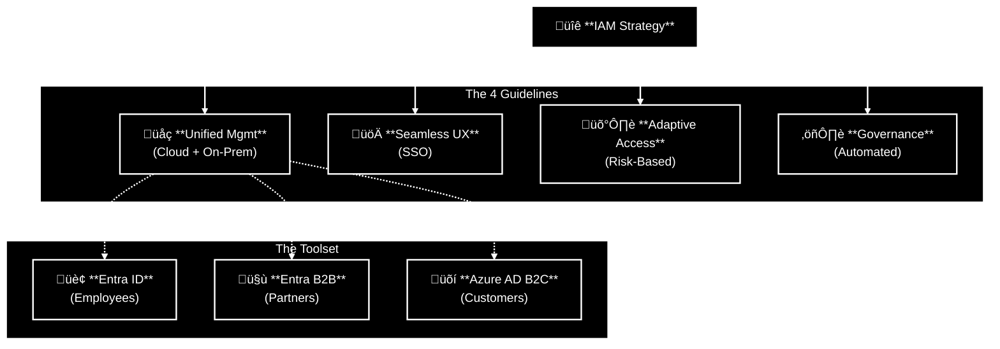
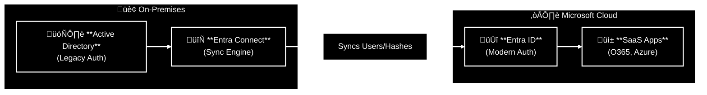
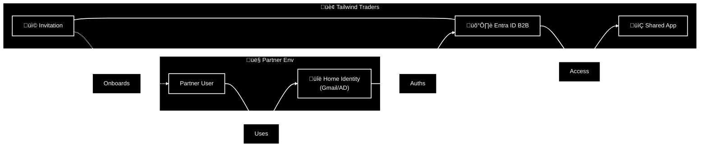
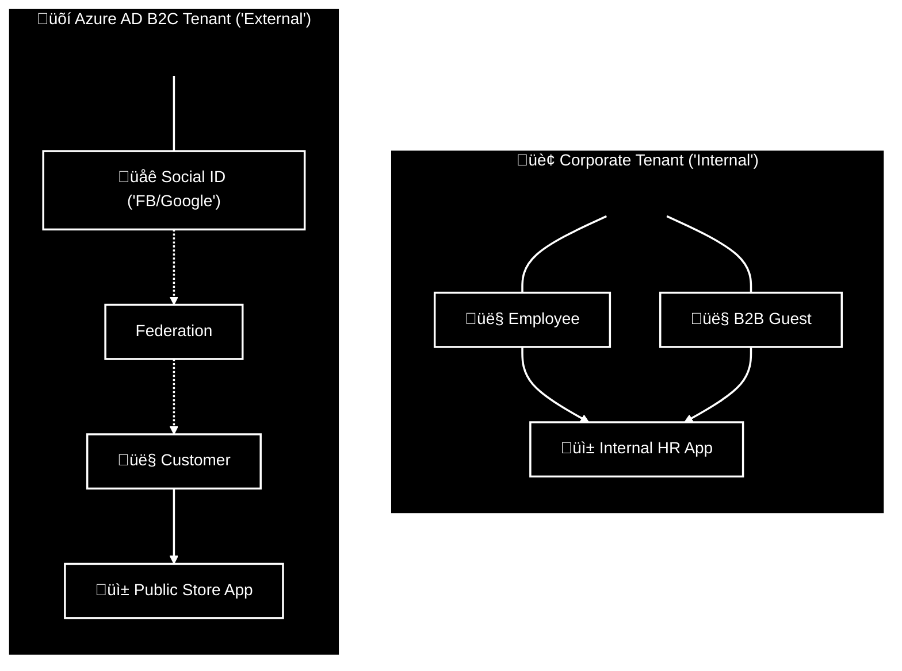

# Design Authentication and authorization solutions

Identity is the **new firewall**. In the old days, you could just hide everything behind a network perimeter and feel safe. In the cloud, that perimeter is gone. Your users are connecting from coffee shops, the API is public, and your data is everywhere.

Designing for identity means accepting a harsh reality: **Hackers don't break in anymore; they log in.**

If you treat Identity like a simple phonebook instead of a security layer, you are finished. You need to verify *who* someone is (Authentication) and strictly control *what* they can touch (Authorization). Without this, your fancy encryption and network rules are just expensive decorations on a house with the front door left wide open.

**Bottom line:**
Secure the identity first. If you don't, you aren't an Architect; you're just setting the table for an attacker to come in, sit down, and eat your lunch using valid credentials.

## Table of Contents
* [Design for identity and access management](#design-for-identity-and-access-management)
* [Design for Microsoft Entra ID](#design-for-microsoft-entra-id)
* [Design for Microsoft Entra business-to-business (B2B)](#design-for-microsoft-entra-business-to-business-b2b)
* [Design for Azure Active Directory B2C (business-to-customer)](#design-for-azure-active-directory-b2c)
* [Design for conditional access](#design-for-conditional-access)
* [Design for identity protection](#design-for-identity-protection)
* [Design for access reviews](#design-for-access-reviews)
* [Design for managed identities](#design-for-managed-identities)
* [Design for service principals for applications](#design-for-service-principals-for-applications)
* [Design for Azure Key Vault](#design-for-azure-key-vault)

## Design for identity and access management

**Key points**
*   **Definition:** IAM solutions manage *who* can access *what*. They must work across users, apps, and devices.
*   **Goal:** Balance **Security** (Control) with **User Experience** (Productivity).
*   **The 4 Pillars of Strong IAM:**
  1.  **Unified Management:** One central place for Cloud and On-Prem identities.
  2.  **Seamless Experience:** Fast sign-in (SSO) so users don't hate IT.
  3.  **Secure Adaptive Access:** Risk-based policies (e.g., "If login is from North Korea, Block it").
  4.  **Simplified Governance:** Automated rules to ensure people lose access when they leave the company.

**Strategic Choices**
The first design decision is selecting the right tool for the user type.

| Scenario | Target Audience | Solution |
| :--- | :--- | :--- |
| **Internal Ops** | Employees | **Microsoft Entra ID** (Core Directory) |
| **Collaboration** | Partners / Vendors | **Microsoft Entra B2B** (Guest Users) |
| **Consumer Apps** | Customers / Public | **Azure AD B2C** (Social Logins, Profile Mgmt) |

**Takeaway**
Don't mix your user bases. Employees go in the main directory. Partners get invited as Guests. Customers get their own separate playground (B2C). Mixing them creates a security nightmare.

## Design for Microsoft Entra ID

**Key points**
*   **Definition:** A multi-tenant, cloud-based directory and identity management service.
*   **Role:** The "Source of Truth" for your users.
*   **Deployment Models:**
    *   **Cloud-only:** You live entirely in Azure (Greenfield).
    *   **Hybrid:** You have an on-prem Active Directory and you sync it to the cloud (Brownfield/Enterprise).

**Hybrid Identity Architecture**
For most enterprises, you aren't starting from scratch. You connect your existing On-Prem AD to the cloud using **Entra Connect**.

### Strategic Design Considerations

1. **Centralized Management (Single Instance)**
     * **Rule:** Use a single Entra directory as the authoritative source.
     * **Why?** Managing multiple identity silos increases the chance of a "Zombie Account" (an ex-employee who still has access) slipping through the cracks.
2. **Sync Strategy (Entra Connect)**
     * **Password Hash Sync (PHS):** Syncs a hash of the password to the cloud.
          * Benefit: Users use the same password on-prem and in the cloud. It also enables Leaked Credential Detection.
     * **Filtering: Do NOT** sync high-privilege on-prem admin accounts to the cloud.
          * Risk: If an attacker breaches the cloud, you don't want them pivoting back to your on-prem domain controllers.
3. **Single Sign-On (SSO)**
     * Enable SSO immediately.
     * **Psychology:** If users have to remember 10 different passwords, they will write them on a sticky note. If they have 1 password (SSO), they might actually keep it secure.
4. **Operational Efficiency**
     * Calculate the cost of not integrating. Managing separate identities (one login for Windows, one for Azure) creates double the helpdesk tickets for password resets.

**Takeaway**
In a Hybrid world, On-Prem AD is the database, but Entra ID is the door. Keep them in sync, or you'll be managing two sets of keys for one house.

## Design for Microsoft Entra business-to-business (B2B)

**Key points**
*   **Definition:** A feature enabling secure collaboration with external partners (Vendors, Suppliers).
*   **Mechanism:** "Bring Your Own Identity" (BYOI). Partners use their own credentials (Gmail, Outlook, their own Corporate ID).
*   **Lifecycle:** You do **not** manage their passwords. You only manage their access to your specific resources.

**The B2B Workflow**
The Guest User is a specific object type in your directory (`UserType = Guest`).

### Strategic Design Considerations

1. **Delegation (App Owners)**
     * **Recommendation:** Do not make IT responsible for inviting every single vendor.
     * **Action:** Delegate permission to **App Owners**. They know which vendors need access to their application better than IT does.
2. **Security (MFA & Conditional Access)**
     * **Rule:** Guests are untrusted by default.
     * **Policy:** Enforce **MFA**. Even if the guest doesn't use MFA at their home company, you can force them to perform MFA to access your data.
     * **Compliance:** You can block guests based on location ("No logins from outside US") or device health.
3. **Identity Providers (Federation)**
     * Don't force partners to create a new "Microsoft Account."
     * Federate with **Google** or **Facebook** so they can just click "Sign in with Google." It reduces friction and support tickets.
4. **Self-Service Sign-Up**
     * Instead of manually sending emails, create a **Self-Service User Flow**.
     * The partner visits a URL, signs up, performs MFA, and gets access automatically (or after approval).

**Takeaway**
Entra B2B lets you work with outsiders without polluting your directory with passwords you have to reset. You control the Door (Access), they control the Key (Password).

## Design for Azure Active Directory B2C

**Important Note!** Azure AD B2C was discontinued as of May 1 2025, i have kept this part for exam purposes. Microsoft Entra External ID is the next gen CIAM plaform built on the Entra stack

**Key points**
*   **Definition:** A specialized directory for managing **Customer** identities (not employees).
*   **Architecture:** Requires a **separate** tenant. It does not sit inside your main Corporate Entra ID.
*   **Goal:** Scale to millions of users without cluttering your corporate directory.
*   **Features:** Social Logins (Facebook/Google), White-label Branding, Self-Service Profile Management.

**The Separation of Church and State**
You must strictly separate your **Workforce** (Employees/Partners) from your **Customers**.

### Strategic Design Considerations

1. **User Flows (The Journey):**
     * Pre-configured policies for common tasks: **Sign-Up**, **Sign-In**, **Profile Edit**, **Password Reset**.
     * Benefit: You don't write code for these pages; you just configure them.
2. **Branding (White-labeling):**
     * You can fully customize the HTML/CSS so the login page looks exactly like your website. The user shouldn't know they left your site.
3. **External User Stores (CRM):**
     * B2C can hold data (100 custom attributes), OR it can act as a gateway to your CRM.
     * Scenario: User logs in -> B2C asks CRM "Is this a VIP?" -> CRM says "Yes" -> User gets VIP access.

| Feature | Microsoft Entra B2B 🤝 | Azure AD B2C 🛒 |
| :--- | :--- | :--- |
| **Target Audience** | **Partners / Vendors** *(Collaboration focused)* | **Customers / Consumers** *(SaaS & E-commerce)* |
| **Directory Location** | **Main Corporate Tenant** *(Added as Guest Object)* | **Separate B2C Tenant** *(Isolated Directory)* |
| **Privacy Model** | **Visible** *(Users can see directory/GAL)* | **Invisible** *(Users are isolated from each other)* |
| **Profile Management** | **IT Managed** *(Access Reviews, Governance)* | **Self-Service** *(Sign-up, Edit Profile flows)* |
| **Identity Source** | **Work / School Account** *(Bring Your Own Identity)* | **Social or Local** *(Facebook, Google, Email)* |

**Takeaway**
If you are building an app for your Sales Team and a Vendor, use **B2B**. If you are building an app for millions of people to buy shoes, use **B2C**.

## Design for conditional access

**Key points**
*   **Definition:** The "If This Then That" logic engine for Identity. It evaluates signals to make access decisions.
*   **Logic:** `Signal (Who/Where/Device)` + `Policy` = `Decision (Allow/MFA/Block)`.
*   **Licensing:** Requires **Microsoft Entra ID P1 or P2**.
*   **Goal:** Move away from a static perimeter (Firewall) to a dynamic perimeter (Identity).

**The Decision Flow**
Conditional Access evaluates every sign-in attempt in real-time.

```mermaid
graph TD
    subgraph Signals ["📡 Signals (Input)"]
        direction TB
        User["👤 User / Group"]
        Loc["🌍 Location / IP"]
        Dev["📱 Device Health"]
        App["☁️ Application"]
    end

    Engine{"🛡️ Conditional Access Engine"}

    subgraph Decisions ["⚡ Enforcement (Output)"]
        direction TB
        Allow["✅ Allow Access"]
        MFA["📲 Require MFA"]
        Block["⛔ Block Access"]
    end

    %% Label Nodes (Converted from text-on-lines)
    L_Safe["Safe"]
    L_Risk["Risky / New Device"]
    L_Ban["Banned Region / Legacy Auth"]

    %% Connections
    User --> Engine
    Loc --> Engine
    Dev --> Engine
    App --> Engine

    %% Decision Flow
    Engine --> L_Safe --> Allow
    Engine --> L_Risk --> MFA
    Engine --> L_Ban --> Block

    %% --- DARK MODE STYLING ---
    %% 1. Node Styling (Black Fill, White Text/Stroke)
    classDef dark fill:#000,stroke:#fff,stroke-width:2px,color:#fff;
    class User,Loc,Dev,App,Engine,Allow,MFA,Block,L_Safe,L_Risk,L_Ban dark;
    
    %% 2. Subgraph Styling (Force Black Background)
    style Signals fill:#000,stroke:#fff,stroke-width:2px,color:#fff
    style Decisions fill:#000,stroke:#fff,stroke-width:2px,color:#fff
    
    %% 3. Arrow Styling (White)
    linkStyle default stroke:#fff,stroke-width:2px;
```

### Strategic Design Considerations

1. **Zero Trust Configuration:**
     * **Named Locations:** Create a list of countries you never do business with (e.g., North Korea, Russia) and Block them globally. Exempt your Admins!
     * **Device Compliance:** Require devices to be "Managed" (Intune Compliant) to access sensitive data. If the device is infected or not updated, access is denied.
2. **Legacy Authentication (CRITICAL):**
     * **The Risk:** Older protocols (POP3, IMAP, SMTP) do not support MFA. Hackers use them to bypass your security.
     * **Action:** Create a policy to **Block Legacy Authentication** for everyone.
3. **Application Controls:**
     * **Approved Client Apps:** You can force users to use Outlook Mobile (which you can wipe) instead of the native Mail app (which you can't control).
4. **Testing (Don't Lock Yourself Out):**
     * **Report-Only Mode:** "What would have happened?" Run policies in simulation mode to see impact without breaking production.
     * **What If Tool:** Simulate a specific login scenario (e.g., "What if John logs in from China?") to see which policies apply.
     * **Break Glass Account:** Always exclude one emergency admin account from your Conditional Access policies in case you misconfigure something and lock everyone out.

**Takeaway**
Conditional Access is the brain of Zero Trust. It allows you to say: "I don't care if you have the correct password; if you are logging in from a jailbroken iPad in a country we don't operate in, you aren't getting in."

## Design for identity protection

**Key points**
*   **Definition:** An automated monitoring tool that detects suspicious activities related to identities.
*   **The "Three Tasks":**
    1.  **Automate Detection:** Find risks (e.g., leaked passwords).
    2.  **Automate Remediation:** Fix them without IT intervention (e.g., force a password reset).
    3.  **Investigate:** Feed data into a SIEM (like Microsoft Sentinel) for deep analysis.

**Risk Types (Critical Distinction)**
You must know the difference between "The User is bad" and "The Login is bad."

| Risk Type | Question it Answers | Calculation Time | Examples |
| :--- | :--- | :--- | :--- |
| **User Risk** | "Is this *Identity* compromised?" | Offline (Background) | • **Leaked Credentials** (Found on Dark Web) • **Threat Intelligence** (Known attack patterns) |
| **Sign-in Risk** | "Is this *Login attempt* suspicious?" | Real-time & Offline | • **Anonymous IP** (Tor Browser) • **Atypical Travel** (Login from London, then NY 1 hour later) • **Password Spray** |

**The Automated Remediation Flow**
Instead of waking up an admin at 3 AM, Identity Protection handles it.

```mermaid
graph TD
    %% Main Entities
    Attacker([🥷 Threat Actor])
    User([👤 Legitimate User])
    
    subgraph Risk_Engine ["🛡️ Identity Protection Engine"]
        direction TB
        Detection{Risk Detected?}
        Type{User or Sign-in?}
    end
    
    subgraph Policy ["📜 Remediation Policy"]
        direction TB
        Reset["🔄 Force Password Reset"]
        MFA["📲 Force MFA"]
        Block["⛔ Block Access"]
    end

    %% Label Nodes (Converted from text-on-lines)
    L_Creds["Leaked Creds"]
    L_Travel["Impossible Travel"]
    L_Yes["Yes"]
    L_UserRisk["User Risk (High)"]
    L_SigninRisk["Sign-in Risk (Medium)"]
    L_Fix1["User Fixes It"]
    L_Fix2["User Fixes It"]

    %% Connections
    Attacker --> L_Creds --> Risk_Engine
    User --> L_Travel --> Risk_Engine
    
    %% Internal Engine Flow
    Risk_Engine --> Detection
    Detection --> L_Yes --> Type
    
    %% Decision Flow
    Type --> L_UserRisk --> Reset
    Type --> L_SigninRisk --> MFA
    
    %% Remediation Loop
    Reset -.-> L_Fix1 -.-> User
    MFA -.-> L_Fix2 -.-> User

    %% --- DARK MODE STYLING ---
    %% 1. Node Styling (Black Fill, White Text/Stroke)
    classDef dark fill:#000,stroke:#fff,stroke-width:2px,color:#fff;
    class Attacker,User,Detection,Type,Reset,MFA,Block,L_Creds,L_Travel,L_Yes,L_UserRisk,L_SigninRisk,L_Fix1,L_Fix2 dark;
    
    %% 2. Subgraph Styling (Force Black Background)
    style Risk_Engine fill:#000,stroke:#fff,stroke-width:2px,color:#fff
    style Policy fill:#000,stroke:#fff,stroke-width:2px,color:#fff
    
    %% 3. Arrow Styling (White)
    linkStyle default stroke:#fff,stroke-width:2px;
```

### Strategic Design Considerations

1. **User Risk Policy (The "You are Hacked" Rule):**
     * **Recommendation:** Set threshold to High.
     * **Action:** Block access and **Require Password Change**.
     * Why? If Microsoft found the user's password on the dark web, MFA isn't enough. The password is dead. Change it.
2. **Sign-in Risk Policy (The "This looks weird" Rule):**
     * **Recommendation:** Set threshold to **Medium and above**.
     * **Action:** Require **MFA**.
     * Why? If a user logs in from a new country, it might be them on vacation. MFA proves it. If they can't pass MFA, block them.
3. **Self-Remediation:**
     * This is the biggest value add. It reduces Helpdesk tickets. The user fixes their own security issue (via MFA or Password Reset) and gets back to work immediately.
4. **SIEM Integration:**
     * Identity Protection data should not stay in Entra ID. Export it to **Microsoft Sentinel** to correlate it with other logs (e.g., Firewall logs).

**Takeaway**
Identity Protection is the **Automated Immune System** for your directory. It creates a self-healing identity infrastructure where risky users clean up their own mess.

## Design for access reviews

**Key points**
*   **The Problem:** "Permission Creep." Employees move teams, accumulate access, and never lose the old access. When they leave, they might still have a backdoor.
*   **The Solution:** Microsoft Entra Access Reviews. A scheduled process to validate if a user *still* needs access.
*   **Scope:** You can review access to **Groups** (Teams/Security), **Applications**, **Access Packages**, and **Privileged Roles** (PIM).

**The Lifecycle Challenge**
Without reviews, access only goes *up*. With reviews, access is pruned.

```mermaid
graph LR
    subgraph Problem ["📈 The Permission Creep"]
        direction TB
        Hire([User Hired])
        Role1[Role A Access]
        Role2[Role B Access]
        Role3[Role C Access]
    end

    subgraph Solution ["✂️ The Access Review"]
        direction TB
        Review{📅 Quarterly Review}
        Manager([👤 Manager / Owner])
        Action[🗑️ Revoke Old Access]
    end

    %% Label Nodes (Converted from text-on-lines)
    L_Promoted["Promoted"]
    L_Moved["Moved"]
    L_Retains1["Retains"]
    L_Retains2["Retains"]
    L_Denies["Denies"]

    %% --- CONNECTIONS ---

    %% 1. The Creep Flow
    Hire --> Role1
    Role1 --> L_Promoted --> Role2
    Role2 --> L_Moved --> Role3
    
    %% 2. The Retention (Dotted Lines)
    Role3 -.- L_Retains1 -.-> Role1
    Role3 -.- L_Retains2 -.-> Role2

    %% 3. The Solution Flow
    Role3 --> Review
    Manager --> L_Denies --> Review
    Review --> Action

    %% --- DARK MODE STYLING ---
    %% 1. Node Styling (Black Fill, White Text/Stroke)
    classDef dark fill:#000,stroke:#fff,stroke-width:2px,color:#fff;
    class Hire,Role1,Role2,Role3,Review,Manager,Action dark;
    class L_Promoted,L_Moved,L_Retains1,L_Retains2,L_Denies dark;
    
    %% 2. Subgraph Styling (Force Black Background)
    style Problem fill:#000,stroke:#fff,stroke-width:2px,color:#fff
    style Solution fill:#000,stroke:#fff,stroke-width:2px,color:#fff
    
    %% 3. Arrow Styling (White)
    linkStyle default stroke:#fff,stroke-width:2px;
```

**Who performs the review?**

* **Resource Owner:** Best for checking access to specific Apps or Project Groups.
* **Manager:** Best for checking their direct reports' access.
* **Self-Review:** Useful for low-risk groups ("Do you still need to be in the 'Lunch Menu' group?").

### Strategic Design Considerations
When designing a review plan (e.g., for a Sensitive Finance App), define the logic clearly:

| Component | Implementation Strategy |
| :--- | :--- |
| **Target Resources** | **Microsoft Dynamics** *(Focus on critical Finance Data)* |
| **Frequency** | **Monthly** (High Risk) vs. **Quarterly** (Standard Risk) *(Adaptive scheduling based on sensitivity)* |
| **Reviewers** | **Program Managers** *(They possess the business context on who needs access)* |
| **Duration** | **48 Hours** *(Short time window to force immediate action)* |
| **Auto-Action** | **Remove Access (Fail Closed)** *(If reviewer does not respond, access is automatically revoked)* |
| **Inactive Users** | **Auto-Remove** *(Automatically revoke access if not used for 90 days)* |

**Takeaway**
Access Reviews are the "Garbage Collector" for your identity system. If you don't run them, your directory becomes a museum of stale permissions waiting to be exploited.

