# Design Governance

Governance might sound like boring corporate paperwork, but in Azure, it’s the only thing standing between you and a chaotic, overpriced dumpster fire. You can’t just spin up resources at random and hope for the best. You need a hierarchy—Management Groups, Subscriptions, Resource Groups—that dictates exactly who can do what, who pays the bill, and who gets locked out.

Think of it as the laws of physics for your cloud environment. Without a solid governance design, you aren’t building an enterprise architecture; you’re building a digital Wild West where security is a suggestion, organization is a myth, and your budget exists only to be broken.

**Bottom line:**
Design your hierarchy right from day one, or get ready to explain to your boss why "Dev-Test-VM-01" just ate the entire IT budget for the quarter because nobody put a limit on it.

## Table of Contents
* [Design for Governance](#design-for-governance)
* [Design for management groups](#design-for-management-groups)
* [Design for subscriptions](#design-for-subscriptions)
* [Design for resource groups](#design-for-resource-groups)
* [Design for resource tags](#design-for-resource-tags)
* [Design for Azure Policy](#design-for-azure-policy)
* [Design for role-based access control (RBAC)](#design-for-role-based-access-control-rbac)
* [Design for Azure landing zones](#design-for-azure-landing-zones)

## Design for governance

**Key points**
*   Governance provides the mechanisms and processes to maintain control over applications and resources.
*   It involves determining requirements, planning initiatives, and setting strategic priorities.
*   **Strategy:** To apply governance effectively (via Azure Policy and Tags), you must first create a hierarchical structure.

**The Azure Hierarchy**
A typical hierarchy has four levels. This structure allows you to apply governance strategies exactly where they are needed (Inheritance).

```mermaid
graph TD
    %% Define Nodes
    Root["🏢 **Tenant Root Group**"]
    MG["📂 **Management Groups**"]
    Sub["💳 **Subscriptions**"]
    RG["📦 **Resource Groups**"]
    Res["🖥️ **Resources**"]

    %% Connections
    Root --> MG
    MG --> Sub
    Sub --> RG
    RG --> Res
    
    %% --- DARK MODE STYLING ---
    %% Fill: Black | Stroke: White | Text: White
    classDef dark fill:#000,stroke:#fff,stroke-width:2px,color:#fff;
    
    %% Apply style to all nodes
    class Root,MG,Sub,RG,Res dark;
    
    %% Make arrows white
    linkStyle default stroke:#fff,stroke-width:2px;
```

### Hierarchy Levels
1. **Tenant Root Group**
     * Contains all management groups and subscriptions.
     * Allows global policies and RBAC assignments to be applied at the directory level.
2. **Management Groups**
     * Help manage access, policy, and compliance for multiple subscriptions at once.
3. **Subscriptions**
     * Logical containers that serve as units of management and scale.
     * Act as the **billing boundary**.
4. **Resource Groups**
     * Logical containers where Azure resources are deployed and managed.
     * Resources share a lifecycle here.
5. **Resources**
     * Instances of services you create (e.g., Virtual Machines, SQL Databases, Storage Accounts).

**Takeaway**
You don't just organize resources for neatness; you organize them to apply **Governance**. The hierarchy defines the **Scope** of your control.

## Design for management groups

**Key points**
* Management groups are containers that sit *above* subscriptions.
* They allow you to manage access, policy, and compliance for many subscriptions at once through **inheritance**.
* **Limit:** Up to 6 levels of depth (excluding Root and Subscription levels).

**Why use them?**
1.  **Policy:** Limit regions (e.g., "West Europe only") for all subscriptions under a group.
2.  **Access:** Give a user "Reader" access at the group level, and they inherit it on every subscription below.
3.  **Audit:** Monitor compliance across the entire organization in one view.

**Proposed Hierarchy Strategy (Tailwind Traders Example)**
Don't just mirror your Org Chart. Design for **Governance**.

```mermaid
graph TD
    %% Define Nodes with Icons
    Root["🏢 **Tenant Root Group**"]
    Top["🏭 **Tailwind Traders**<br>(Top-Level)"]
    
    Platform["🏗️ **Platform MG**"]
    Workloads["💼 **Workloads MG**"]
    Sandbox["🧪 **Sandbox MG**"]
    
    Corp["🏢 **Corporate**"]
    Sales["💰 **Sales Dept**"]
    IT["💻 **IT Dept**"]
    
    Geo_West["⬅️ **West Region**"]
    Geo_East["➡️ **East Region**"]

    %% Connections
    Root --> Top
    Top --> Platform
    Top --> Workloads
    Top --> Sandbox
    
    Workloads --> Corp
    Workloads --> Sales
    Workloads --> IT
    
    Sales --> Geo_West
    Sales --> Geo_East
    
    %% --- DARK MODE STYLING ---
    %% Fill: Black | Stroke: White | Text: White
    classDef dark fill:#000,stroke:#fff,stroke-width:2px,color:#fff;
    
    %% Apply style to all nodes
    class Root,Top,Platform,Workloads,Sandbox,Corp,Sales,IT,Geo_West,Geo_East dark;
    
    %% Make arrows white
    linkStyle default stroke:#fff,stroke-width:2px;
```

### Design Considerations

1. **Keep it Flat:**
     * Aim for no more than **3 to 4 levels**.
     * Too many levels = "Permission Hell" and complex debugging.
2. **Top-Level Group:**
     * Create a root group for your specific organization (e.g., "Tailwind Traders").
     * Apply common platform policies here (e.g., "Audit Logs must be enabled").
3. **Segmentation Strategies:**
     * **Organizational:** Separate by department (HR, IT, Sales) if they have different funding/security needs.
     * **Geographical:** Separate by region (West, East) if you have data residency/compliance laws (GDPR).
     * **Environment:** Separate **Production** from **Non-Prod**.
4. **Sandbox:**
     * Create a dedicated "Sandbox" management group.
     * **Why?** Let users experiment with Azure resources isolated from Prod. If they break it, the blast radius is contained.
5. **Sensitive Data:**
     * Isolate highly sensitive departments (Legal/HR) into their own branch.
     * Apply enhanced compliance policies (stricter lockouts) only to that branch.

**Takeaway**
Management Groups are the "skeleton" of your governance. Build them right, and policies flow down automatically. Build them wrong, and you'll be manually fixing permissions forever.

## Design for subscriptions

**Key points**
*   **Definition:** A logical container that serves as a unit of **Management**, **Scale**, and **Billing**.
*   **Role:** You cannot have Azure without a subscription. It is the boundary where you pay money and hit resource limits.
*   **Types:** Pay-As-You-Go, Enterprise Agreement (EA), CSP.

**Strategic Design Considerations**

1.  **Democratized Management**
    *   Don't be afraid to create multiple subscriptions. Align them to business needs (e.g., separate subscriptions for "East Region" and "West Region" if they have different budgets).

2.  **Shared Services Strategy**
    *   **Best Practice:** Create a dedicated **"Shared Services"** subscription.
    *   **Content:** Hub Networking (ExpressRoute, Virtual WAN, Firewall), Domain Controllers, Bastion Hosts.
    *   **Benefit:** Central IT pays for the plumbing; workload owners pay for their own apps.

3.  **Scale Limits (The "Noisy Neighbor" Problem)**
    *   Subscriptions have hard limits (e.g., API request limits, Max Cores).
    *   **Action:** Move massive workloads (SAP, HPC, IoT) into their own dedicated subscriptions to prevent them from starving other apps of resources.

4.  **Billing & Isolation**
    *   **Dev/Test vs. Prod:** Always separate them.
    *   **Why?**
        1.  **Cost:** Dev/Test subscriptions often get discounted rates (Dev/Test pricing).
        2.  **Security:** You don't want a junior dev accidentally deleting Production resources.
    *   **Compliance:** If a workload needs PCI (Credit Card) compliance, isolate it in a subscription with strict policies, rather than applying those strict rules to the whole company.

5.  **Network Constraints**
    *   **Constraint:** A Virtual Network (VNet) cannot span across subscriptions.
    *   **Solution:** You must use VNet Peering to connect resources in Subscription A to Subscription B.

**Proposed Subscription Hierarchy**

```mermaid
graph TD
    %% Define Nodes with Icons
    MG["📂 **Workload MG**"]
    
    Shared["🔌 **Shared Services Sub**"]
    Prod["🚀 **Production Sub**"]
    Dev["🧪 **Dev/Test Sub**"]
    
    Net["🛡️ **ExpressRoute / Firewall**"]
    Live["🏭 **Live App Resources**"]
    Test["🏗️ **Sandbox Resources**"]

    %% Connections
    MG --> Shared
    MG --> Prod
    MG --> Dev
    
    Shared --> Net
    Prod --> Live
    Dev --> Test

    %% --- DARK MODE STYLING ---
    %% Fill: Black | Stroke: White | Text: White
    classDef dark fill:#000,stroke:#fff,stroke-width:2px,color:#fff;
    
    %% Apply style to all nodes
    class MG,Shared,Prod,Dev,Net,Live,Test dark;
    
    %% Make arrows white
    linkStyle default stroke:#fff,stroke-width:2px;
```

### Governance Tip: Access Reviews

* Subscription Owners often accumulate over time.
* Use **Microsoft Entra Privileged Identity Management (PIM)** to force quarterly reviews. Ask owners: "Do you still need to own this billing account?"

**Takeaway**
Treat subscriptions as flexible tools, not rigid boxes. Use them to isolate costs ("Who pays?"), isolate environments ("Prod vs Dev"), and bypass resource limits.

# Design for resource groups

**Key points**
*   **Definition:** Logical containers where Azure resources are deployed and managed.
*   **Role:** Every resource must exist in one (and only one) Resource Group.
*   **Lifecycle Boundary:** The most common use is to group resources that share a lifecycle so you can deploy, update, and **delete** them together.

**Critical Rules & Constraints**
1.  **Metadata Location:** You assign a region to the Resource Group (e.g., East US). This is where the *metadata* is stored.
    *   *Risk:* If East US goes down, you cannot update resources in that group (metadata lock), even if the resources themselves (e.g., a VM in West Europe) are running fine.
2.  **No Nesting:** You cannot put a Resource Group inside another Resource Group. It is a flat list.
3.  **No Renaming:** Once created, you cannot rename a Resource Group.
4.  **Region Agnostic:** Resources *inside* the group can be in any region (e.g., RG in East US contains a VM in North Europe).

**Grouping Strategies**
Decide how you want to manage permissions and lifecycle.

```mermaid
graph TD
    %% Strategy 1: By Lifecycle (App)
    subgraph By_App [📦 Strategy: By Lifecycle]
        RG_App1["📂 **RG-App1**<br>(Unified Lifecycle)"]
        Web1["🌐 **Web App**"]
        SQL1["🛢️ **SQL DB**"]
        
        RG_App1 --> Web1
        RG_App1 --> SQL1
    end

    %% Strategy 2: By Type (Admin)
    subgraph By_Type [🔧 Strategy: By Type]
        RG_SQL["📂 **RG-SQL-Cluster**<br>(DBA Managed)"]
        DB_A["🛢️ **App1 DB**"]
        DB_B["🛢️ **App2 DB**"]
        
        RG_SQL --> DB_A
        RG_SQL --> DB_B
    end

    %% --- DARK MODE STYLING ---
    %% Node Styling
    classDef dark fill:#000,stroke:#fff,stroke-width:2px,color:#fff;
    class RG_App1,Web1,SQL1,RG_SQL,DB_A,DB_B dark;
    
    %% Subgraph Styling (Force Black Background)
    style By_App fill:#000,stroke:#fff,stroke-width:2px,color:#fff
    style By_Type fill:#000,stroke:#fff,stroke-width:2px,color:#fff
    
    %% Arrow Styling
    linkStyle default stroke:#fff,stroke-width:2px;
```

### Strategic Considerations

1. **Lifecycle (The Golden Rule):** "Do I deploy, update, and delete these things together?" If yes, put them in the same group.
     * Example: A Dev environment. When testing is done, you delete the `RG-Dev` and everything vanishes. Clean.
2. **Access Control (RBAC):**
     * By Type: If you have a dedicated DBA team, putting all SQL DBs in `RG-SQL` makes it easy to give them "Contributor" rights to just that group.
     * By App: If an App Team owns the whole stack, `RG-App1` gives them control over their Web and DB.
3. **Resource Locks:**
     * Apply a **CanNotDelete** lock at the Resource Group level to protect everything inside it from accidental deletion.

**Takeaway**
Resource Groups are not just folders; they are **Lifecycle** and **Security** boundaries. Group by App for ease of deployment, or group by Type for specialized IT teams.

## Design for resource tags

**Key points**
*   **Definition:** Metadata consisting of **Name-Value pairs** (e.g., `Environment = Production`).
*   **Purpose:** Enable effective searching, cost reporting (Chargeback), and automated scripting.
*   **Constraint:** Tags applied to a Resource Group are **NOT inherited** by the resources inside it by default. You must apply them specifically to the resources (or use Azure Policy to force inheritance).

**Tagging Strategies**
Organizations typically align tags to either IT operations or Business value.

| Alignment Strategy | Focus Area | Example Scenario |
| :--- | :--- | :--- |
| **IT-Aligned** | Workload, Function, Environment | "This server is running *Apache* in the *Dev* environment." (Ops focus) |
| **Business-Aligned** | Accounting, Ownership, Value | "This server belongs to *Marketing* and generates *High Revenue*." (Finance focus) |

> **Trend:** Many organizations are shifting towards **Business-aligned** tagging to better understand the ROI of IT assets.

**Tag Categories**
A robust taxonomy usually mixes these five categories to cover all bases:

| Tag Type | Description | Example Key-Value Pairs |
| :--- | :--- | :--- |
| **Functional** | Categorizes purpose within a workload. | `App = CatalogSearch` `Tier = Web` `Env = Production` |
| **Classification** | Identifies security/policy requirements. | `Confidentiality = Private` `SLA = 24Hours` |
| **Accounting** | Associates costs with internal groups. | `Department = Finance` `Program = Campaign-X` `Region = NorthAmerica` |
| **Partnership** | Identifies people/contacts. | `Owner = JSmith` `ContactAlias = IT-Support` `Stakeholders = User1;User2` |
| **Purpose** | Aligns resources to business decisions. | `BusinessProcess = Support` `BusinessImpact = Critical` `RevenueImpact = High` |

**Visualization: A Tagged Resource**

```mermaid
graph LR
    Resource["💻 **VM-Web-Prod**"]
    
    subgraph Metadata ["🏷️ Applied Tags"]
        direction TB
        T1["**Env:** Production"]
        T2["**Dept:** Finance"]
        T3["**Owner:** JSmith"]
        T4["**Patch:** Weekly"]
    end
    
    Resource --- T1
    Resource --- T2
    Resource --- T3
    Resource --- T4

    %% --- DARK MODE STYLING ---
    %% Fill: Black | Stroke: White | Text: White
    classDef dark fill:#000,stroke:#fff,stroke-width:2px,color:#fff;
    
    %% Apply style to Nodes
    class Resource,T1,T2,T3,T4 dark;
    
    %% Apply style to the Subgraph (The Box around the tags)
    style Metadata fill:#000,stroke:#fff,stroke-width:2px,color:#fff
    
    %% Make lines white
    linkStyle default stroke:#fff,stroke-width:2px;
```

### Design Considerations

1. **Start Small:** Do not try to solve world hunger. Prototype with 3-5 critical tags (e.g., Cost Center, Owner, Environment) before adding complexity.
2. **Enforce with Policy:** Tagging relies on humans, and humans forget things. Use Azure Policy to:
     * Deny creation if a tag is missing.
     * Append a tag automatically if it's missing.
     * Inherit tags from the Resource Group (via specific "Remediation" policies).
3. **Scope:** Not every resource needs every tag. "Impact" tags might only apply to mission-critical workloads, while "Environment" tags apply to everything.

**Takeaway**
Tags are the only way to make sense of your billing bill at the end of the month. Without `CostCenter` tags, your Azure bill is just one big unrecognizable number.

## Design for Azure Policy

**Key points**
*   **Definition:** A service that enforces rules on your resources to ensure they comply with corporate standards (e.g., "All VMs must use Managed Disks").
*   **Scope:** Policies are **inherited**. If you apply a policy at the Management Group level, it applies to every Subscription and Resource Group below it.
*   **Initiatives:** A group of related policies bundled together (e.g., "ISO 27001 Compliance Initiative" contains 50+ individual policies).

**Policy vs. RBAC (The Critical Distinction)**
This is the #1 confusion point. You must use them together.

| Feature | Azure RBAC | Azure Policy |
| :--- | :--- | :--- |
| **Focus** | **User Actions** (Who?) | **Resource State** (What?) |
| **Logic** | "Does John have permission to create a VM?" | "Is the VM in the allowed region?" |
| **Result** | Allow or Deny Access. | Allow, Deny, or **Modify** the resource. |
| **Analogy** | The **Bouncer** checking IDs at the club door. | The **Dress Code**. (Even if the bouncer lets you in, you can't enter without a tie). |

```mermaid
graph TD
    %% Define Main Nodes
    User([👤 User / Admin])
    Request[📝 Request: Create VM in 'West US']
    
    subgraph Gatekeepers ["🛡️ The Governance Gate"]
        direction TB
        RBAC{🔑 RBAC Check}
        Policy{📜 Policy Check}
    end
    
    Result_Success[✅ Resource Created]
    Result_Fail[⛔ Action Blocked]

    %% Define Decision "Label" Nodes 
    %% (These replace the text on the lines so they can be styled black)
    L1[No Permission]
    L2[Has Permission]
    L3[Region Not Allowed]
    L4[Compliant]

    %% Connections
    User --> Request
    Request --> RBAC
    
    %% RBAC Flow
    RBAC --> L1 --> Result_Fail
    RBAC --> L2 --> Policy
    
    %% Policy Flow
    Policy --> L3 --> Result_Fail
    Policy --> L4 --> Result_Success

    %% --- DARK MODE STYLING ---
    %% Fill: Black | Stroke: White | Text: White
    classDef dark fill:#000,stroke:#fff,stroke-width:2px,color:#fff;
    
    %% Apply style to ALL nodes (including the decision labels)
    class User,Request,RBAC,Policy,Result_Success,Result_Fail,L1,L2,L3,L4 dark;
    
    %% Apply style to the Gatekeepers Box (Force Black Background)
    style Gatekeepers fill:#000,stroke:#fff,stroke-width:2px,color:#fff
    
    %% Make arrows white
    linkStyle default stroke:#fff,stroke-width:2px;
```

### Policy Effects (How it handles non-compliance)

1. **Deny:** Blocks the request. The resource is never created. (Best for strict security).
2. **Audit:** Allows the creation but flags it as "Non-Compliant" in the dashboard. (Best for existing brownfield resources).
3. **Modify / Append:** Automatically changes the resource during deployment. (e.g., "If `CostCenter` tag is missing, add `CostCenter: 999`").
4. **DeployIfNotExist:** If a required extension (like the Monitoring Agent) is missing, Policy deploys it for you.

### Evaluation Triggers (When does it check?)

* **Real-time:** When a resource is Created, Updated, or Deleted.
* **Periodic:** A full compliance scan runs every 24 hours.
* **Assignment:** When a policy is newly assigned or updated.

**Takeaway**
RBAC stops the wrong people from touching your environment. Azure Policy stops the right people from doing the wrong things (like creating a $5,000/month VM by accident).

