# Design Governance

Governance might sound like boring corporate paperwork, but in Azure, it’s the only thing standing between you and a chaotic, overpriced dumpster fire. You can’t just spin up resources at random and hope for the best. You need a hierarchy—Management Groups, Subscriptions, Resource Groups—that dictates exactly who can do what, who pays the bill, and who gets locked out.

Think of it as the laws of physics for your cloud environment. Without a solid governance design, you aren’t building an enterprise architecture; you’re building a digital Wild West where security is a suggestion, organization is a myth, and your budget exists only to be broken.

**Bottom line:**
Design your hierarchy right from day one, or get ready to explain to your boss why "Dev-Test-VM-01" just ate the entire IT budget for the quarter because nobody put a limit on it.

## Table of Contents
* [Design for Governance](#design-for-governance)
* [Design for management groups](#design-for-management-groups)
* [Design for subscriptions](#design-for-subscriptions)
* [Design for resource groups](#design-for-resource-groups)
* [Design for resource tags](#design-for-resource-tags)
* [Design for Azure Policy](#design-for-azure-policy)
* [Design for role-based access control (RBAC)](#design-for-role-based-access-control-rbac)
* [Design for Azure landing zones](#design-for-azure-landing-zones)

## Design for governance

**Key points**
*   Governance provides the mechanisms and processes to maintain control over applications and resources.
*   It involves determining requirements, planning initiatives, and setting strategic priorities.
*   **Strategy:** To apply governance effectively (via Azure Policy and Tags), you must first create a hierarchical structure.

**The Azure Hierarchy**
A typical hierarchy has four levels. This structure allows you to apply governance strategies exactly where they are needed (Inheritance).

```mermaid
graph TD
    %% Define Nodes
    Root["🏢 **Tenant Root Group**"]
    MG["📂 **Management Groups**"]
    Sub["💳 **Subscriptions**"]
    RG["📦 **Resource Groups**"]
    Res["🖥️ **Resources**"]

    %% Connections
    Root --> MG
    MG --> Sub
    Sub --> RG
    RG --> Res
    
    %% --- DARK MODE STYLING ---
    %% Fill: Black | Stroke: White | Text: White
    classDef dark fill:#000,stroke:#fff,stroke-width:2px,color:#fff;
    
    %% Apply style to all nodes
    class Root,MG,Sub,RG,Res dark;
    
    %% Make arrows white
    linkStyle default stroke:#fff,stroke-width:2px;
```

### Hierarchy Levels
1. **Tenant Root Group**
     * Contains all management groups and subscriptions.
     * Allows global policies and RBAC assignments to be applied at the directory level.
2. **Management Groups**
     * Help manage access, policy, and compliance for multiple subscriptions at once.
3. **Subscriptions**
     * Logical containers that serve as units of management and scale.
     * Act as the **billing boundary**.
4. **Resource Groups**
     * Logical containers where Azure resources are deployed and managed.
     * Resources share a lifecycle here.
5. **Resources**
     * Instances of services you create (e.g., Virtual Machines, SQL Databases, Storage Accounts).

**Takeaway**
You don't just organize resources for neatness; you organize them to apply **Governance**. The hierarchy defines the **Scope** of your control.

