# Design a solution to log and monitor Azure resources

In on-premises days, you could walk into the server room and see the blinking orange light. In Azure, **logs are your only eyes and ears**.

If you treat logging as an afterthought or a "debug tool" for developers, you are flying blind. You need **Observability**. You need to know that the database is slowing down *before* it crashes, and you need to know a hacker is brute-forcing your admin account *before* they get in. Without this, you are purely reactive, running around putting out fires while your customers tweet about your downtime.

**Bottom line:**
If your users have to call you to tell you the application is down, you have already failed. Design your monitoring so you know about the problem (and the solution) before the phone even rings.

## Table of Contents
* [Design for Azure Monitor data resources](#design-for-azure-monitor-data-resources)
* [Design for Azure Monitor Logs (Log Analytics) workspaces](#design-for-azure-monitor-logs-log-analytics-workspaces)
* [Design for Azure Workbooks and Azure insights](#design-for-azure-workbooks-and-azure-insights)
* [Design for Azure Data Explorer](#design-for-azure-data-explorer)

## Design for Azure Monitor data resources

**Key points**
*   **Definition:** A comprehensive solution for collecting, analyzing, and acting on telemetry from your cloud and on-premises environments.
*   **The Two Pillars:** Azure Monitor relies on two fundamental types of data: **Metrics** (Numbers) and **Logs** (Text/Records).
*   **Scope:** It collects data from the Application layer down to the OS and the Azure Platform itself.

**The Architecture of Monitoring**
Data flows from your resources into the Monitor platform, where it splits into two streams based on how you need to query it.

```mermaid
graph LR
    subgraph Sources ["📡 Data Sources"]
        direction TB
        App["📱 **Application**<br>(Code/Traces)"]
        OS["💻 **Guest OS**<br>(Win/Linux)"]
        Res["☁️ **Azure Resource**<br>(VM/SQL)"]
    end

    subgraph Platform ["⚙️ Azure Monitor"]
        direction TB
        Metrics["📊 **Metrics Store**<br>(Numerical/Real-Time)"]
        Logs["📝 **Logs Store**<br>(Text/Complex Query)"]
    end

    subgraph Actions ["⚡ Consumption"]
        direction TB
        Alerts["🚨 **Alerts**"]
        Dash["📈 **Dashboards**"]
        KQL["🔍 **KQL Queries**"]
    end

    %% Connections
    App --> Metrics
    App --> Logs
    OS --> Metrics
    OS --> Logs
    Res --> Metrics
    Res --> Logs

    Metrics --> Alerts
    Metrics --> Dash
    Logs --> KQL
    Logs --> Dash

    %% --- DARK MODE STYLING ---
    %% 1. Node Styling (Black Fill, White Text/Stroke)
    classDef dark fill:#000,stroke:#fff,stroke-width:2px,color:#fff;
    class App,OS,Res,Metrics,Logs,Alerts,Dash,KQL dark;
    
    %% 2. Subgraph Styling (Force Black Background)
    style Sources fill:#000,stroke:#fff,stroke-width:2px,color:#fff
    style Platform fill:#000,stroke:#fff,stroke-width:2px,color:#fff
    style Actions fill:#000,stroke:#fff,stroke-width:2px,color:#fff
    
    %% 3. Arrow Styling (White)
    linkStyle default stroke:#fff,stroke-width:2px;
```

| Feature | Metrics (Numerical) 📊 | Logs (Text/Records) 📝 |
| :--- | :--- | :--- |
| **What is it?** | **A Number** at a specific time. *(e.g., CPU = 85%)* | **A Detailed Record**. *(e.g., "Error: DB Connection Failed")* |
| **Speed** | **Near Real-Time** *(Instant availability)* | **Variable Latency** *(Depends on ingestion time)* |
| **Primary Use** | **Alerting & Trending** *(Is the system healthy?)* | **Debugging & Root Cause** *(Why did it break?)* |
| **Structure** | **Lightweight** *(Time-series database)* | **Heavy / Detailed** *(Structured or unstructured text)* |

### Data Sources
You need to decide what to collect based on what you are running.

1. **Windows Events:** System and Application logs (including Sysmon).
2. **Syslog:** The standard logging system for Linux.
3. **Performance Counters:** Raw numbers (Memory usage, Disk Queue Length).
4. **IIS Logs:** Web server traffic logs from Windows machines.
5. **JSON/Text Logs:** Custom application logs written to a local disk.

### Strategic Desing Considerations

1. **Alerting Strategy:**
     * Use **Metrics** for "The house is on fire" alerts (CPU > 90% for 5 mins). It's fast.
     * Use **Logs** for "Why did the house catch fire?" analysis (Search for specific error codes).
2. **Agent Strategy:**
     * To get OS-level data (inside the VM), you must install the **Azure Monitor Agent (AMA)**. Azure cannot see inside your VM's OS without it.

**Takeaway**
Metrics tell you **User Experience** (Is it slow?). Logs tell you **Technical Detail** (Why is it slow?). You need both.

## Design for Azure Monitor Logs (Log Analytics) workspaces

**Key points**
*   **Definition:** A specific Azure resource that acts as the database for your logs. It serves as the administrative boundary for data storage, retention, and access.
*   **Structure:** Data is organized into **Tables**. Each data source (e.g., Syslog, Heartbeat) writes to its own table.
*   **Scale:** Workspaces can handle petabytes. You do **not** need to split workspaces just because of data volume (unless you hit 500 GB/day and need a dedicated cluster).

**Deployment Models**
The biggest decision you will make is: *How many workspaces do we need?*

| Model | Description | Pros/Cons |
| :--- | :--- | :--- |
| **Centralized (Hub & Spoke)** | **Recommended.** All logs go to one central workspace managed by IT/SecOps. | ✅ Easy correlation. ✅ Simple management. ⚠️ Requires "Resource-Context" access for security. |
| **Decentralized** | Every team gets their own workspace. | ✅ Clear ownership. ✅ Strong isolation. ❌ Cannot correlate logs (Siloed data). ❌ Hard to manage global alerts. |
| **Hybrid** | A mix of both. | ❌ Complex, expensive, and gaps in coverage. Avoid. |

**Access Modes (The "Magic" of Centralization)**
How do you let a Developer see their logs in a Centralized workspace without letting them see HR's logs?

| Access Mode | Description | Use Case |
| :--- | :--- | :--- |
| **Workspace-Context** | User has permission on the **Workspace itself**. They can see *everything* in it. | **Central IT / Security Admins**. |
| **Resource-Context** | User has permission on the **Resource** (e.g., the VM). They can see logs *only* for that VM, even though the workspace holds data for 1,000 other VMs. | **App Developers / DevOps**. |

### Strategic Desing Considerations

1. **Data Sovereignty (The Geographic Exception):**
     * You might want a centralized workspace, but if German law says "Data cannot leave Germany," you must create a separate workspace in the `Germany West Central` region for those resources.
2. **Cost (Data Egress):**
     * If your VM is in `East US` and your Workspace is in `West Europe`, you pay for Data Transfer fees.
     * Best Practice: Keep the workspace in the same region as the bulk of your resources.
3. **Governance:**
     * Use **Azure Policy** to automatically configure every new VM to send logs to the Central Workspace. Do not rely on manual setup.

**Takeaway**
Centralize your logs. Use **Resource-Context RBAC** to filter what users see. Splitting workspaces creates data silos that make debugging impossible.

## Design for Azure Workbooks and Azure insights

**Key points**
*   **Azure Workbooks:** A flexible canvas for creating rich, interactive reports. It is the "Power BI" of the Azure Portal.
*   **Azure Insights:** Pre-packaged, curated monitoring experiences for specific resources (VMs, Containers, SQL) that are often built *using* Workbooks.
*   **The Power:** Workbooks can combine data from disparate sources (e.g., join a SQL query with a Resource Graph query) into a single view.

**The Monitoring Stack**
Don't build from scratch unless you have to.

```mermaid
graph TD
    subgraph Data ["📡 Raw Telemetry"]
        direction TB
        Logs["📝 Logs"]
        Metrics["📊 Metrics"]
        ARG["🔍 Resource Graph"]
    end

    subgraph Visualization ["🖼️ The Presentation Layer"]
        direction TB
        Insights["📦 **Azure Insights**<br>(Pre-Built Experience)"]
        CustomWB["🎨 **Custom Workbook**<br>(Your Custom View)"]
    end

    subgraph Output ["👀 The Result"]
        direction TB
        Troubleshoot["🛠️ Root Cause Analysis"]
        Playbook["📖 Operational Playbook"]
        Dashboard["📈 Executive Dashboard"]
    end

    %% Label Node (Converted from text-on-line)
    L_BuiltOn["Built on"]

    %% Connections
    Data --> Insights
    Data --> CustomWB
    
    %% Dotted relationship
    Insights -.- L_BuiltOn -.-> CustomWB
    
    Insights --> Troubleshoot
    CustomWB --> Playbook
    CustomWB --> Dashboard

    %% --- DARK MODE STYLING ---
    %% 1. Node Styling (Black Fill, White Text/Stroke)
    classDef dark fill:#000,stroke:#fff,stroke-width:2px,color:#fff;
    class Logs,Metrics,ARG,Insights,CustomWB,Troubleshoot,Playbook,Dashboard,L_BuiltOn dark;
    
    %% 2. Subgraph Styling (Force Black Background)
    style Data fill:#000,stroke:#fff,stroke-width:2px,color:#fff
    style Visualization fill:#000,stroke:#fff,stroke-width:2px,color:#fff
    style Output fill:#000,stroke:#fff,stroke-width:2px,color:#fff
    
    %% 3. Arrow Styling (White)
    linkStyle default stroke:#fff,stroke-width:2px;
```

| Insight Name | Target Resource | What it gives you (Value) |
| :--- | :--- | :--- |
| **Application Insights** | **Web Apps / APIs** | **APM (Code-Level Tracing)** Exceptions, page load times, and request tracing. |
| **VM Insights** | **Virtual Machines** | **Service Map View** Shows active processes and network connections. *(e.g., "VM A talks to SQL DB on port 1433")* |
| **Container Insights** | **AKS / Kubernetes** | **Cluster Health** Node & Pod status, container logs (stdout/stderr). |
| **Network Insights** | **VNets / Gateways** | **Connectivity Map** Visualizes dependencies, packet loss, and health. |
| **Storage / KV Insights** | **Storage / Vaults** | **Performance & Capacity** Latency spikes, transaction failures, and usage limits. |

### Strategic Design Considerations

1. **Buy vs. Build:**
     * **Rule:** Always check if a native "Insight" exists before building a custom Workbook.
     * Example: Don't write KQL queries to check VM disk space; just enable **VM Insights**.
2. **The "Single Pane of Glass":**
     * Use Custom Workbooks to combine data that doesn't usually live together.
     * Scenario: A dashboard showing the **SQL CPU** (Metrics), the **App Error Rate** (App Insights), and the **Cost** (Cost Management) in one view.
3. **Operational Playbooks:**
    * Workbooks are interactive. You can embed text steps alongside data.
    * Use Case: An "Incident Response" workbook that guides a junior admin:
      1. "Check CPU" (Graph automatically shown).
      2. "If High, Check Processes" (Query automatically shown).
      3. "Restart Service" (Button to trigger Logic App).

**Takeaway**
Dashboards are static. Workbooks are interactive stories. Use Workbooks to explain why something happened, not just that it happened.

