# Azure Identity, Access, & Security

> **Architectural Philosophy:** Identity is the new firewall. If you want to secure anything in Azure, you treat identity like the front door to your kingdom. Permissions, policies, and verifications lock together like a vault puzzle.

> **Bottom line:** Lock your house now, because Future You isn't trying to explain to your boss why some rogue Service Principal just joy-rode through your subscription like it's GTA Free Roam.

## Table of Contents
- [1. Azure Directory Services](#1-azure-directory-services)
- [2. Authentication Methods](#2-authentication-methods)
- [3. External Identities](#3-external-identities)
- [4. Conditional Access](#4-conditional-access)
- [5. Role-Based Access Control (RBAC)](#5-role-based-access-control-rbac)
- [6. Zero Trust Model](#6-zero-trust-model)
- [7. Defense in Depth](#7-defense-in-depth)
- [8. Microsoft Defender for Cloud](#8-microsoft-defender-for-cloud)

---

## 1. Azure Directory Services

**Microsoft Entra ID** (formerly Azure AD) is the identity backbone. It handles authentication, SSO, and device management. If the account isn't right, nothing else works right.

### The Ecosystem
1.  **Microsoft Entra ID:** The cloud boss. Handles global auth, SSO, and App Management.
2.  **Entra Connect:** The bridge. Syncs on-prem AD to the cloud.
3.  **Entra Domain Services:** The legacy compatibility layer. Managed Domain Controllers for apps that need Kerberos/NTLM/LDAP.

### Identity Sync Flow
How on-prem and cloud identities merge:

```mermaid
graph TD
    OnPrem[🏢 On-Premises Active Directory]
    Connect[🔁 Entra Connect Sync]
    Entra[☁️ Microsoft Entra ID]
    CloudApps[📱 Cloud Apps / SaaS]
    DS[📦 Entra Domain Services]
    Legacy[📠 Legacy Workloads via LDAP/Kerberos]

    OnPrem -->|Syncs Identities| Connect
    Connect -->|Populates| Entra
    Entra -->|Auth Token| CloudApps
    Entra -.->|One-Way Sync| DS
    DS -->|Domain Join/Auth| Legacy
```

**Key Takeaways**

* **Entra Connect:** Makes on-prem and cloud act like one system.
* **Domain Services:** Use this only if you need to lift-and-shift old apps that require legacy protocols (Kerberos) without managing Domain Controller VMs yourself.

## 2. Authentication Methods
Authentication is proving who you are. Modern Azure identity balances **High Security** with **High Convenience**.

### The Hierarchy of Auth

* **Passwords:** Low Security, High Convenience (BAD).
* **MFA:** High Security, Low Convenience (BETTER).
* **Passwordless: High Security, High Convenience (BEST).

### Passwordless Flow
Eliminates the weakest link (the password) by combining a device you have with a biometric you are.

```mermaid
graph LR
    User -->|Unlocks| Device[💻 Trusted Device / Phone]
    Device -->|Biometric/PIN| Auth[✅ Authenticated]
    
    subgraph Methods
    WH[Windows Hello]
    AuthApp[Authenticator App]
    FIDO[FIDO2 Security Key]
    end
```

**Key Takeaways**

* **SSO (Single Sign-On):** One identity per user means fewer weak credentials floating around.
* **MFA(Multifactor):** The single biggest security upgrade you can turn on. Stops 99.9% of account takeovers.

## 3. External Identities
How to collaborate with outsiders (Partners, Vendors, Customers) without giving them the keys to the castle.

**Governance:** Guest access is only safe if you keep it clean. Use Access Reviews to automatically flush out old vendor accounts.

## 4. Conditional Access

The "Brain" of Entra ID. It functions as an automated security guard that reads the guest list instead of waving everyone in.
Logic: `Signal` + `Decision` = `Enforcement`

```mermaid
graph LR
    subgraph Signals
    User[👤 User Risk]
    Loc[🌍 Location]
    Dev[💻 Device Health]
    end

    subgraph Policy_Engine
    CA{Conditional Access}
    end

    subgraph Controls
    Allow[✅ Allow]
    MFA[📱 Require MFA]
    Block[⛔ Block]
    end

    User --> CA
    Loc --> CA
    Dev --> CA
    
    CA -->|Safe| Allow
    CA -->|Suspicious| MFA
    CA -->|High Risk| Block
```

**Common Scenarios:**

*  *Admin Role?* -> Always require MFA.
*  *Risky Country?* -> Block access.
*  *Unknown Device?* -> Require MFA + Password Change.

## 5. Role-Based Access Control (RBAC)
**Principle of Least Privilege:** Give people only what they need, and nothing extra.

### Scope and Inheritance
Permissions trickle down. If you assign "Owner" at the top, they own everything below it.

**Key Takeaways**

* **Allow Model:** Roles are additive. (Reader + Contributor = Contributor).
* **Control Plane:** RBAC controls access to the resource (turning a VM on/off), not necessarily the data inside the OS.

## 6. Zero Trust Model

**Old School:** "I trust you because you are on the office Wi-Fi."
**Zero Trust:** "Trust no one. Verify everything."

### The 3 Pillars of Zero Trust
1. **Verify Explicitly:** Always authenticate based on all data points (Identity, Location, Device Health).
2. **Use Least Privilege:** Just-In-Time (JIT) and Just-Enough-Access (JEA).
3. **Assume Breach:** Segment networks and encrypt data as if the attacker is already inside.

### Zero Trust Workflow

```mermaid
graph TD
    Request[User Request] --> Verify[Verify Identity & Device]
    Verify --> Policy[Check Policy & Context]
    Policy -->|Approved| JIT[Grant JIT Access]
    Policy -->|Denied| Block[⛔ Block]
    JIT --> Log[📝 Audit & Monitor]
```

## 7. Defense in Depth
Security is an onion. The goal is to slow the attacker down at every layer.

```mermaid
graph TD
    %% Layer 1
    Physical["🏢 Physical Security"]
    
    %% Layer 2
    Identity["👤 Identity & Access"]
    
    %% Layer 3 - This was the error line. 
    %% FIX: Wrapped in outer quotes, changed inner quotes to single quotes.
    Perimeter["🚧 Perimeter ('DDoS/Firewall')"]
    
    %% Layer 4
    Network["🕸️ Network Security"]
    
    %% Layer 5
    Compute["💻 Compute / Host"]
    
    %% Layer 6
    App["📱 Application"]
    
    %% Layer 7 (The Core)
    Data["💾 Data (Encryption)"]

    %% Connect the Defense in Depth layers
    Physical --> Identity
    Identity --> Perimeter
    Perimeter --> Network
    Network --> Compute
    Compute --> App
    App --> Data

    %% DARK MODE STYLING
    classDef dark fill:#111,stroke:#fff,stroke-width:2px,color:#fff;
    class Physical,Identity,Perimeter,Network,Compute,App,Data dark;

    %% Make the connecting arrows white
    linkStyle default stroke:#fff,stroke-width:2px;
```

**The Strategy:** If one layer fails (e.g., Phishing bypasses Identity), the next layer (Network/Compute) stops the breach from reaching the Data.

## 8. Microsoft Defender for Cloud
A unified **CSPM** (Cloud Security Posture Management) and CWP (Cloud Workload Protection) tool.

**Core Workflow:** `Assess` -> `Secure` -> `Defend`

```mermaid
graph LR
    Assess[🔍 Assess]
    Secure[🛡️ Secure]
    Defend[🚨 Defend]

    Assess -->|Find Vulnerabilities| Secure
    Secure -->|Harden Resources| Defend
    Defend -->|Detect Threats| Assess
```

* **Assess:** "You have open ports on 5 VMs." (Secure Score).
* **Secure:** "Apply this policy to close ports." (Hardening).
* **Defend:** "Alert: Brute force attack detected on VM-01." (Threat Protection).

    **Integration:**  Defender works on **Azure**, **AWS**, **GCP**, and **On-Prem** (via Azure Arc). It provides a single pane of glass for multi-cloud security.
