# Module: Core architectural components of Azure
# Key notes

In order to design anything you have to understand how regions, subscriptions, and resources all fit together like a 25-piece puzzle. This foundation determines how stable, secure, and scalable your solutions will end up.

> **Bottom line:** Architect brain now so future you doesn't have to clean up technical debt later.

## Table of Contents
- [Azure Regions](#azure-regions)
- [Region Pairs](#region-pairs)
- [Sovereign Regions](#sovereign-regions)
- [Availability Zones](#availability-zones)
- [AzureDatacenters](#azure-datacenters)
- [Azure Resources and Resource groups](#azure-resources-and-resource-groups)
- [Subscriptions](#subscriptions)
- [Management Groups](#management-groups)
- [Hierarchy of Resources](#hierarchy-of-resources)

# Azure regions

**Geographical areas** that contain at least one (but usually more) datacenters, networked together with a low-latency network.
*   Azure assigns and controls resources within each region to ensure balanced workloads.

> **Note:** Some services or VM features are only available in certain regions (e.g., specific VM sizes or storage types like Ultra Disk).

# Region pairs

**Key Takeaways**

*   Most regions are paired with another region in the same geography for resiliency.
*   It allows for the replication of resources across geography, reducing the likelihood of interruptions from natural disasters, civil unrest, or power outages.
*   *Crucial:* Not all Azure services automatically replicate data. In many cases (IaaS), recovery and replication must be configured by the customer.

# Additional advantages
**Key Takeaways**

  * **Prioritized Recovery:** During an extensive outage, one region out of every pair is prioritized to ensure at least one is restored ASAP.
  * **Sequential Updates:** System updates are rolled out to one region at a time (never both simultaneously) to minimize downtime risk.
  *  **Data Residency:** Data continues to reside within the same geography for tax and legal jurisdiction purposes.
  *  **Pairing logic:** Regions are paired in two directions to back each other up.
       * Exception: West India and Brazil South are one-direction only (Primary does not backup the Secondary).

# Sovereign regions
**Key Takeaways**

* Instances isolated from the main instance of Azure (physical and logical separation).
* **Use case:** Mostly used for strict compliance or legal purposes (e.g., US Gov, China).

# Availability zones
**Key Takeaways**

* Physically separate datacenters within a single region.
* **Isolation:** Each zone is self-sufficient with independent power, cooling, and networking.
* **Boundary:** Acts as an isolation boundary—if one zone goes down, the others continue.
* **Minimum:** Each supported region has a minimum of 3 separate Availability Zones.

```mermaid
graph TB
    subgraph Region [Azure Region]
        style Region fill:#f9f9f9,stroke:#333,stroke-width:2px
        
        subgraph AZ1 [Zone 1]
            style AZ1 fill:#fff,stroke:#333
            P1[⚡ Power]
            N1[🌐 Network]
        end
        
        subgraph AZ2 [Zone 2]
            style AZ2 fill:#fff,stroke:#333
            P2[⚡ Power]
            N2[🌐 Network]
        end
        
        subgraph AZ3 [Zone 3]
            style AZ3 fill:#fff,stroke:#333
            P3[⚡ Power]
            N3[🌐 Network]
        end
    end

    LB[Load Balancer] --> AZ1
    LB --> AZ2
    LB --> AZ3
```

# Azure datacenters
**Key Takeaways**

* Large facilities that form the physical infrastructure of Azure.
* They contain everything corporate datacenters have (racks, servers, cooling) but at massive scale.
* **Access:** Not directly accessible or visible to users.
* **Grouping:** They are grouped physically into **Availability Zones** and **Regions**.

# Azure Resources and Resource groups.
**Key Takeaways**

* **Resource:** The basic building block. Anything you create is a resource (VM, Database, VNet, Public IP).
* **Resource Group (RG): A logical container that holds related resources.
* **Rules:**
    * Resource groups **cannot** be nested.
    * A single resource can only exist in **one** group at a time.
    * Moving resources between groups removes their association with the former group.
* **Lifecycle:** Deleting the group deletes **everything** inside it (great for cleaning up labs).
* **Strategy:** Group resources based on lifecycle (created/deleted together) and access schema (RBAC).

# Subscriptions
**Key Takeaways**

* The unit of management, billing, and scale.
* **Structure:** A way to logically organize resource groups.
* **Multi-Sub:** An account can have multiple subscriptions to configure different billing models or access policies.
* **Boundaries:**
    1. **Billing Boundary:** Determines how an Azure account is billed. You can generate separate invoices for different departments.
    2. **Access Control Boundary:** Applies management policies at the sub level (e.g., Prod vs. Dev).
* **Types:**
    * *Free Trial:* Access to 25 products, €200 credit for 30 days.
    * *Pay-As-You-Go: Standard monthly billing.

# Management groups
**Key Takeaways**

* Enterprise-level management at a scale *above* subscriptions.
* **Inheritance:** Policies applied here cascade down to all subscriptions (e.g., "Restrict VM creation to West Europe only").
* **Nesting:**  Can be nested to create a governance tree.

# Hierarchy of resources

* You can build a flexible structure of management groups and subscriptions to organize resources into a hierarchy.
* Allows for unified policy and access management (RBAC).

# Important!

* **10,000** management groups can be supported in a single directory.
* Management group trees can support up to **six levels** of depth (excluding the root level).
* Each group and subscription can support only **one parent**.

