# Azure Storage Services

> **Architectural Philosophy:** To build anything serious in Azure, you treat storage like the backbone of your setup. Blobs, files, redundancy levels—it all decides whether your data survives a bad day or dies crying in a burning datacenter somewhere.

> **Bottom line:** Understand your storage game now, because Future You does not want to be that guy recovering corrupted blobs at 3 AM wondering why the whole app went down over a bad redundancy choice.

## Table of Contents
- [1. Azure Storage Accounts](#1-azure-storage-accounts)
- [2. Storage Redundancy](#2-storage-redundancy)
- [3. Storage Service Types](#3-storage-service-types)
- [4. Data Migration (Big Data)](#4-data-migration-big-data)
- [5. File Movement (Small Data)](#5-file-movement-small-data)
- [6. Summary](#6-summary)

---

## 1. Azure Storage Accounts

A Storage Account provides a unique namespace for your data, accessible via HTTP/HTTPS globally.

### Account Types
| Type | Best For | Supported Services |
| :--- | :--- | :--- |
| **Standard General Purpose v2** | *Default Choice* | Blobs, Queues, Tables, Azure Files, Data Lake. |
| **Premium Block Blobs** | High Performance | Block Blobs, Append Blobs (Low latency). |
| **Premium File Shares** | Enterprise Files | Azure Files (SMB/NFS) with high IOPS. |
| **Premium Page Blobs** | VM Disks | Page Blobs only (OS/Data Disks). |

### Endpoints
Your storage account name creates your public URL.
*   **Blob:** `https://<name>.blob.core.windows.net`
*   **File:** `https://<name>.file.core.windows.net`
*   **Data Lake:** `https://<name>.dfs.core.windows.net`

> **Constraint:** Names must be 3-24 characters, lowercase letters and numbers only.

---

## 2. Storage Redundancy

This determines how many copies of your data exist and where they live.

### Primary Region Redundancy
*   **LRS (Locally Redundant):** 3 copies in **one datacenter**. (Lowest cost, protects against disk failure, vulnerable to fire/flood).
*   **ZRS (Zone Redundant):** 3 copies across **3 Availability Zones**. (Protects against datacenter failure).

### Secondary Region Redundancy (Disaster Recovery)
* **GRS (Geo-Redundant):** LRS in Primary + LRS in Secondary.
* **GZRS (Geo-Zone-Redundant):** ZRS in Primary + LRS in Secondary (Maximum Protection).

**Read Access (RA-GRS):** By default, the secondary region is locked until a disaster occurs. Enabling Read-Access allows you to read from the secondary anytime (great for global reporting).

## 3. Storage Service Types
Azure Storage is a platform containing multiple data services.

```mermaid
graph TD
    %% Define Nodes
    Blob["📦 **Blobs**<br>Scalable Object Storage<br><i>(Images, Backups)</i>"]
    File["📂 **Files**<br>Managed SMB Shares<br><i>(Lift & Shift)</i>"]
    Queue["📨 **Queues**<br>Async Messaging<br><i>(App Decoupling)</i>"]
    Disk["💿 **Disks**<br>Block Storage<br><i>(VM Hard Drives)</i>"]
    Table["📊 **Tables**<br>NoSQL Key-Value<br><i>(Structured Data)</i>"]

    %% Positioning (Layout them in two rows for better width)
    subgraph Storage_Services [Azure Storage Services]
        direction TB
        Blob ~~~ File ~~~ Queue
        Disk ~~~ Table
    end

    %% DARK MODE MONOCHROME STYLES
    %% Fill: Black | Stroke: White | Text: White
    classDef dark fill:#000,stroke:#fff,stroke-width:2px,color:#fff;
    
    %% Style the nodes
    class Blob,File,Queue,Disk,Table dark;
    
    %% Style the container
    style Storage_Services fill:#1a1a1a,stroke:#fff,stroke-width:2px,color:#fff
```

**Blob Tiers:**
   * **Hot:** Frequent access.
   * **Cool:** Infrequent (stored 30+ days).
   * **Archive:** Rare (stored 180+ days, retrieval takes hours).

## 4. Data Migration (Big Data)
Tools for moving servers, databases, or massive datasets to Azure.

### Azure Migrate
The central hub for "Lift and Shift" projects.

* Discovery: Finds on-prem servers (VMware/Hyper-V).
* Assessment: Tells you if they are ready for Azure and estimates cost.
* Migration: Actually moves the VMs and Databases.

### Azure Data Box
Physical hardware shipped to your door when the network is too slow.

* **Capacity:** 80 TB per device.
* **Process:** You copy data -> Ship back to Microsoft -> They upload to Azure.
* **Security:** AES 256-bit encryption, disks wiped upon completion.
* **Rule of Thumb:** Use if data is > 40 TB or network is limited.

## 5. File Movement (Small Data)
Tools for daily management or hybrid syncing

```mermaid
graph LR
    %% --- ROW 1: AzCopy ---
    AzCopy["💻 **AzCopy**"] --> Type1([Command Line])
    Type1 --> Feat1["🚀 **Fastest Transfer**<br>Scriptable / One-way sync"]

    %% --- ROW 2: Storage Explorer ---
    Explorer["📂 **Storage Explorer**"] --> Type2([GUI Application])
    Type2 --> Feat2["🖱️ **Drag-and-Drop**<br>Built on AzCopy"]

    %% --- ROW 3: Azure File Sync ---
    AFS["🔄 **Azure File Sync**"] --> Type3([Hybrid Service])
    Type3 --> Feat3["🏢 **Syncs On-Prem Server**<br>Cloud Tiering (Hot vs Cold)"]

    %% --- DARK MODE STYLING ---
    %% Fill: Black | Stroke: White | Text: White
    classDef dark fill:#000,stroke:#fff,stroke-width:2px,color:#fff;
    
    %% Apply style to all nodes
    class AzCopy,Type1,Feat1,Explorer,Type2,Feat2,AFS,Type3,Feat3 dark;
    
    %% Make connecting lines white
    linkStyle default stroke:#fff,stroke-width:2px;
```

## 6. Summary

* Accounts: Your global namespace. Pick standard v2 unless you need specialized premium speed.
* Redundancy:
     * LRS: Cheap, risky.
     * ZRS: High Availability.
     * GRS: Disaster Recovery.
* Services: Blobs (Unstructured), Files (SMB), Queues (Messages), Disks (VMs).
* Migration:
     * Online: Azure Migrate.
     * Offline: Data Box.
     * Hybrid: Azure File Sync.
