# Module: Azure Well-Architected Framework pillars
# Key notes

](https://learn.microsoft.com/en-us/azure/well-architected/)

The role of a solution architect is to balance business requirements with technical capabilities. You are not just delivering features; you are designing systems that are scalable, resilient, efficient, and secure. The **Azure Well-Architected Framework (WAF)** provides the guiding tenets to do this.

**Bottom line:**
There is no "one-size-fits-all" architecture, but WAF provides universal concepts to build a reliable foundation regardless of the technology stack.

## Table of Contents
*   [Reliability](#reliability)
*   [Security](#security)
*   [Cost Optimization](#cost-optimization)
*   [Operational Excellence](#operational-excellence)
*   [Performance Efficiency](#performance-efficiency)
*   [Trade-offs](#trade-offs-between-pillars)

---

# Reliability

**Key points**
*   **Goal:** The system must continue to function even when things go wrong.
*   **Resilience:** The ability to detect failure, withstand it (Self-Healing), and recover quickly.
*   **Availability:** Ensuring users can access the workload when needed at the expected quality.
*   **Mindset:** "Anticipate failure at all levels."

**Takeaway**
A reliable workload recovers from failures within the time stakeholders expect. It is not about *never* failing; it is about *recovering* so fast the user barely notices.

# Security

**Key points**
*   **Goal:** Make workloads resilient to attacks and limit damage if a breach occurs.
*   **Principles:** Built on **Zero Trust** (Assume breach) and the **CIA Triad** (Confidentiality, Integrity, Availability).
*   **Risk:** Security incidents hurt reputation, operations, and finances.

**Takeaway**
Security is about defense depth. Ask yourself: "Are my defenses strong enough to stop attacks and limit the blast radius if they get in?"

# Cost Optimization

**Key points**
*   **Goal:** Ensure money is put to good use and aligned with business goals (ROI).
*   **Constraint:** Design is driven by financial constraints.
*   **Action:** Define spending patterns, prioritize budget areas, and eliminate waste.

**Takeaway**
Cost optimization isn't just "spending less"—it's about maximizing the value of every dollar spent.

# Operational Excellence

**Key points**
*   **Goal:** Keep systems running smoothly through standardized processes.
*   **DevOps:** Implements development, observability, and release management procedures.
*   **Consistency:** Standardized workflows reduce "process variance," human error, and customer disruption.

**Takeaway**
Unreliable operations lead to downtime. Excellence comes from automation, team cohesion, and visibility into system health.

# Performance Efficiency

**Key points**
*   **Goal:** Handle changes in demand without breaking the user experience.
*   **Scaling:**
    *   *High Load:* Resources increase to maintain performance.
    *   *Low Load:* Resources decrease to conserve cost.
*   **Strategy:** You need a solid strategy to keep performance targets on track over time.

```mermaid
graph TD
    Demand[📈 User Demand Increases]
    Scale[⚙️ Auto-Scale Adds Resources]
    Perf[✅ Performance Stays Stable]
    
    Demand --> Scale
    Scale --> Perf
```

**Takeaway**

* **Reality Check:** In an ideal world, you build the most secure, fastest, cheapest, and most reliable system. In reality, you have to choose.
* **The Cost of Perfection:** optimizing one pillar often costs money, time, or agility in another.
* **Decision Making:** Architects must determine which trade-offs are acceptable based on organizational priorities.

**Common Trade-offs:**

* Reliability vs. Cost: High Availability (Multi-region) costs more money.
* Security vs. Performance: Heavy encryption inspection can slow down traffic.
* Speed vs. Operations: Rushing features to market might hurt operational stability.

**Takeaway**
Architecture is the art of compromise. You cannot have it all, so align your trade-offs with what the business values most.
