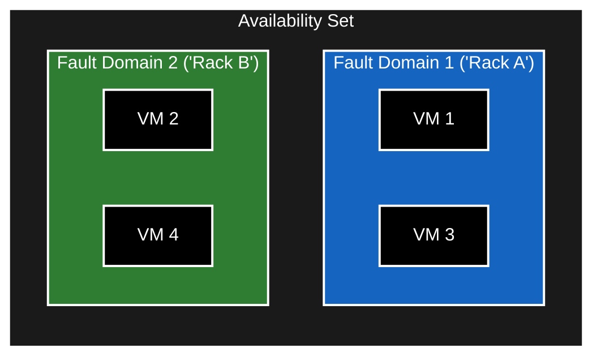

# Azure Compute & Networking Services

> **Architectural Philosophy:** Compute provides the horsepower, but Networking provides the highway. VMs, containers, functions, VNets, and routing all snap together like a puzzle that determines the speed, security, and reliability of your solution.

> **Bottom line:** Build smart now, because Future You isn't trying to debug a busted network at 2 AM wondering why a VM can't talk to anything.

## Table of Contents
- [1. Azure Virtual Machines](#1-azure-virtual-machines)
- [2. Azure Virtual Desktop (AVD)](#2-azure-virtual-desktop-avd)
- [3. Azure Containers](#3-azure-containers-aci-aca-aks)
- [4. Azure Functions](#4-azure-functions-serverless)
- [5. Application Hosting](#5-application-hosting-app-service)
- [6. Virtual Networking (VNet)](#6-virtual-networking-vpn)
- [7. Azure ExpressRoute](#7-azure-expressroute)
- [8. Azure DNS](#8-azure-dns)

---

## 1. Azure Virtual Machines

**IaaS (Infrastructure as a Service):** You get raw control. You manage the OS, the software, and the config.

### Scaling & Availability
Managing one VM is easy. Managing 1,000 requires strategy.

**1. Virtual Machine Scale Sets (VMSS)**
*   **What:** Automatically create and manage a group of load-balanced VMs.
*   **Why:** Ideal for big data, compute-heavy workloads, and auto-scaling apps.

**2. Availability Sets**
*   **What:** Logical grouping to keep VMs separate within a datacenter to ensure high availability.
*   **Fault Domains (FD):** Separate racks (Power/Network).
*   **Update Domains (UD):** Separate reboot cycles during Azure maintenance.

**Takeaway**
* **VMs** = Raw Control.
* **Scale Sets** = Auto-scaling.
* **Availability Sets** = 99.95% HA within a Datacenter.

## 2. Azure Virtual Desktop (AVD)
**Desktop as a Service:** Delivers Windows 10/11 desktops and apps to any device (Mac, iOS, Android, HTML5).

**Key Features:**
* **Multi-Session:** Windows 10/11 Enterprise allows multiple users on a single VM (better cost/performance than Windows Server RDS).
* **Security:** No data stored on the local device. Identity managed by Entra ID + MFA.

## 3. Azure Containers (ACI, ACA, AKS)
**Containers:** Lightweight, portable application packaging. No OS management. Fast startup.

**Service:**

```mermaid
graph TD
    %% Nodes ordered by Complexity/Control
    
    %% Level 1: Simple
    ACI["🚀 **ACI** (Container Instances)<br><br>**Best For:** Speed / Burst<br>**Arch:** No Orchestration"]
    
    %% Level 2: Balanced
    ACA["☁️ **ACA** (Container Apps)<br><br>**Best For:** Microservices / Autoscaling<br>**Arch:** K8s (Hidden Complexity)"]
    
    %% Level 3: Complex
    AKS["🏢 **AKS** (Kubernetes Service)<br><br>**Best For:** Enterprise / Full Control<br>**Arch:** Full Orchestration"]

    %% Connections showing the hierarchy
    ACI -->|More Features / More Complexity| ACA
    ACA -->|Full Control / Manual Management| AKS

    %% DARK MODE STYLING
    %% Fill: Dark Grey (#222) | Stroke: White (#fff) | Text: White (#fff)
    classDef darkmode fill:#111,stroke:#fff,stroke-width:2px,color:#fff;
    
    %% Apply style
    class ACI,ACA,AKS darkmode
    
    %% White arrows
    linkStyle default stroke:#fff,stroke-width:2px;
```

