# Azure Compute & Networking Services

> **Architectural Philosophy:** Compute provides the horsepower, but Networking provides the highway. VMs, containers, functions, VNets, and routing all snap together like a puzzle that determines the speed, security, and reliability of your solution.

> **Bottom line:** Build smart now, because Future You isn't trying to debug a busted network at 2 AM wondering why a VM can't talk to anything.

## Table of Contents
- [1. Azure Virtual Machines](#1-azure-virtual-machines)
- [2. Azure Virtual Desktop (AVD)](#2-azure-virtual-desktop-avd)
- [3. Azure Containers](#3-azure-containers-aci-aca-aks)
- [4. Azure Functions](#4-azure-functions-serverless)
- [5. Application Hosting](#5-application-hosting-app-service)
- [6. Virtual Networking (VNet)](#6-virtual-networking-vpn)
- [7. Azure ExpressRoute](#7-azure-expressroute)
- [8. Azure DNS](#8-azure-dns)

---

## 1. Azure Virtual Machines

**IaaS (Infrastructure as a Service):** You get raw control. You manage the OS, the software, and the config.

### Scaling & Availability
Managing one VM is easy. Managing 1,000 requires strategy.

**1. Virtual Machine Scale Sets (VMSS)**
*   **What:** Automatically create and manage a group of load-balanced VMs.
*   **Why:** Ideal for big data, compute-heavy workloads, and auto-scaling apps.

**2. Availability Sets**
*   **What:** Logical grouping to keep VMs separate within a datacenter to ensure high availability.
*   **Fault Domains (FD):** Separate racks (Power/Network).
*   **Update Domains (UD):** Separate reboot cycles during Azure maintenance.

**Takeaway**
* **VMs** = Raw Control.
* **Scale Sets** = Auto-scaling.
* **Availability Sets** = 99.95% HA within a Datacenter.

## 2. Azure Virtual Desktop (AVD)
**Desktop as a Service:** Delivers Windows 10/11 desktops and apps to any device (Mac, iOS, Android, HTML5).

**Key Features:**
* **Multi-Session:** Windows 10/11 Enterprise allows multiple users on a single VM (better cost/performance than Windows Server RDS).
* **Security:** No data stored on the local device. Identity managed by Entra ID + MFA.

## 3. Azure Containers (ACI, ACA, AKS)
**Containers:** Lightweight, portable application packaging. No OS management. Fast startup.

**Service:**

## 4. Azure Functions (Serverless)
**Event-Driven Compute:** No servers, no VMs, no containers. You upload code, and Azure runs it when something happens (HTTP, Timer, Queue, or "Karen" from HR sending an email).

**Billing:** Pay only while the code is running (Consumption Plan).

### Logic Flow

* **Stateless:** Function runs -> Finishes -> Forgets everything.
* **Stateful (Durable):** Function runs -> Saves context -> Next function picks up where it left off.

## 5. Application Hosting (App Service)
**PaaS (Platform as a Service):** Fully managed hosting for Web Apps, APIs, and Mobile Backends.

**Core Benefits:**

* **OS:** Windows or Linux (Tux the Penguin approved).
* **Languages:** .NET, Java, Node, Python, PHP, Ruby.
* **DevOps:** Built-in CI/CD integration with GitHub/Azure DevOps.
* **Deployment Slots:** Swap "Staging" to "Production" instantly with zero downtime.

     **Takeaway:** App Service is the "Easy Button" for web hosting. No VM management required.

## 6. Virtual Networking (VPN)
**The Nervous System:** Connects VMs, Services, and On-Premises sites.

### Core Capabilities

1. **Isolation:** You control the IP address space (VNet) and segmentation (Subnets).
2. **Internet Access:** Public IPs & Load Balancers. You decide what is exposed ("Red pill or blue pill").
3. **Filtering:**
   
       * NSG (Network Security Group): Basic L4 Firewall (Allow/Deny Port 80, 443, etc).
       * NVA (Network Virtual Appliance): Enterprise Firewall (Palo Alto, Fortinet, Azure Firewall).

5. **Peering:** Connect two VNets together securely via Microsoft's backbone (Global reach).

### Connectivity Models

## 7. Azure ExpressRoute
**Private Fiber Connection:*** A dedicated physical link between your on-prem datacenter and Azure. Traffic never touches the public internet.

**Why use it?**

1. Security: Private connectivity (Mission critical / Regulated industries).
2. Reliability: Consistent latency and no packet loss.
3. Global Reach: Connect Asia office to Europe Azure region via Microsoft's backbone.

**Routing:** Routing: Uses **BGP** (Border Gateway Protocol) to dynamically exchange routes between your network and Azure.

```mermaid
graph TD
    %% Define Nodes
    VPN["🌐 **VPN Gateway**<br><br>Medium: Public Internet<br>Speed: 10 Gbps<br>SLA: Good"]
    ER["🔒 **ExpressRoute**<br><br>Medium: Private Fiber<br>Speed: 100 Gbps<br>SLA: Enterprise"]

    %% Positioning
    VPN ~~~ ER

    %% DARK MODE MONOCHROME STYLES
    %% Fill: Black | Stroke: White | Text: White
    classDef dark fill:#000,stroke:#fff,stroke-width:2px,color:#fff;
    class VPN,ER dark;
```

## 8. Azure DNS
**Domain Name System:** Microsoft's global network answering "Where is website.com?"
**Features:**

* Global: Uses Anycast routing (closest server answers first).
* Private Zones: Resolve internal hostnames (e.g., 'db.internal.corp') inside your VNets.
* Alias Records: Auto-updating records. If your Public IP changes, the DNS record updates automatically.
* Security: Protected by RBAC and Resource Locks (prevents accidental deletion).

    **Important:** Azure DNS hosts the records. You still buy the domain name (e.g., 'cool-cloud-architect.com') from a registrar (GoDaddy, Namecheap, or App Service Domains).
