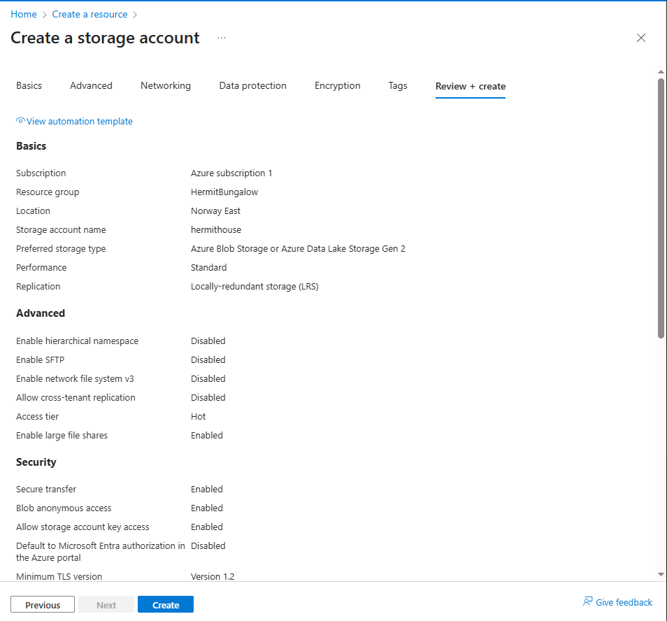

# Module: Azure storage services
## Lab: Azure Storage Account + Blob creation and Access Control

### Objective
Deploy a storage account, create a private blob container, upload a file, test access behavior, and modify access levels.  
Focus is on understanding storage account configuration, blob security, and public access flows.

---

## 1. Create storage account

### Actions
1. Signed in to Azure Portal  
2. Created new RG `HermitBungalow`  
3. Created a **Storage Account** with the following configuration:

**Core settings**
* Storage account type: Azure Blob Storage or Azure Data Lake Storage Gen 2  
* Region: Default region  
* Redundancy: LRS
* Anonymous access on containers: Enabled (Advanced tab)

### Outcome
* Storage account successfully deployed  
* Unique global namespace assigned  
* LRS redundancy configured  
* Anonymous container access allowed (account level)

### Evidence

---

## 2. Create a Blob container

### Actions
1. Navigated to **Data storage → Containers**  
2. Created container with:  
   * Name: `basement`  
   * Access level: Private (no anonymous access)

### Outcome
* Private container created  
* No public access allowed (default secure posture)

### Evidence

---

## 3. Upload a blob

### Actions
1. Downloaded or selected an image file locally  
2. Uploaded file into the container  
3. Opened blob → viewed its properties  
4. Copied blob URL  

### Verification  
Attempted to open blob URL in a new browser tab.  
Result: Access denied because container is private.

Expected error:

### Outcome
* Blob uploaded 
* URL reachable but blocked due to private access level

## 4. Change access level and retest

**Actions**
* Returned to the container  
* Changed access level to **Blob (anonymous read access for blobs only)**  
* Saved the new access configuration  
* Refreshed the browser tab with the blob URL  

**Outcome**
* Blob became publicly readable without authentication  
* Access control change verified successfully  

**Evidence**

## 5. Cleanup

**Actions**
* Deleted resource group **HermitBungalow**  
* Verified all related resources were removed  

**Outcome**
* Environment cleaned up  
* No unnecessary charges left behind  

---

## Key learnings

### Storage accounts
* Namespaces determine how your data is exposed globally  
* Redundancy choice impacts durability and cost  

### Containers
* Default container state is private for security  
* Public access must be intentionally enabled  

### Blobs
* Blob level access depends on container access configuration  
* Changing access level immediately affects public visibility  

### Security
* Even when account level anonymous access is allowed  
  each container still controls its own exposure  
* Nothing becomes public unless **you** turn the key  

**Takeaway**  
You decide what gets exposed. Azure never makes data public unless you explicitly allow it.

### References

### Azure

https://learn.microsoft.com/et-ee/training/modules/describe-azure-storage-services/5-exercise-create-storage-blob
https://learn.microsoft.com/et-ee/azure/storage/blobs/
